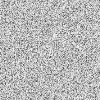

# Noiz


[](https://github.com/ElliottjPierce/noiz/actions)

A simple, configurable, blazingly fast noise library built for and with [Bevy](https://bevyengine.org/).

Here's some fbm simplex noise as a taste:


Noiz is:
- Simple
- Extendable
- Blazingly fast (meant for realtime use)
- Easy to use in Bevy
- Built in pure rust
- Consistent between platforms (on paper)
- Serializable
- Reflectable
- Readable
- Under development (as I have time and features are requested)
- Free and open source forever (feel free to open issues and prs!)
- No Std compatible

Noiz is not:
- Spelled correctly (noise was already taken)
- Mathematically precise (only supports `f32` types for now)
- Fully optimized yet (algebraic float math is not stable in rust yet)
- Meant to replace art tools for asset generation
- Meant to be standalone (you'll want to also depend on either `bevy_math` or `bevy`.)

## What Makes Noiz Unique?

- Noiz is powered by a custom random number generator built on a hash function instead of the traditional permutation table.
  This gives competitive performance while using less memory and reducing tiling artifacts.
- Noiz seamlessly integrates with Bevy!
- Noiz changes seed automatically between octaves (which prevents some artifacting common in other libraries).
- Noiz is endlessly cusomizable. Really, the combinations and settings are limitless!
- Noiz is `no_std`.
- Noiz supports all your favorite noise types. If you see one that's missing, please open an issue!
- Noiz supports noise derivatives and gradiesnts, allowing fast erosion approximations, etc.
- Noiz supports many noise types that other libraries do not, for example, distance-to-edge worly noise and smooth worly noise.

## Quick Start

Let's start with white noise.

```rust
use bevy_math::prelude::*;
use noiz::prelude::*;
// Create noise that, per cell, where each cell is on an orthogonal (cartesian) grid, creates a random unorm (between 0 and 1) `f32`.
let white_noise = Noise::<PerCell<OrthoGrid, Random<UNorm, f32>>>::default();
// Sample the noise in 2d to return an f32. We could also do 3d or 4d and ask for anything that implements `From` f32.
let some_value: f32 = white_noise.sample(Vec2::new(1.0, 2.3));
```

How does this work? Just a quick overview:

A `NoiseFunction` is a trait that takes an input, a random number generator, and produces an output.
It can produce different output types based on the input type.
`NoiseFunction`s can be chained together by putting them in tuples, ex: `(F1, F2)`.
In the example above, `PerCell` is a noise function.

`Noise` is a struct that holds a `NoiseFunction` as well as a `u32` seed and an `f32` frequency.
`Noise` implements `Sampleable`, allowing the inner `NoiseFunction` to be sampled,
`ConfigurableNoise`, allowing the seed and frequency to be set, and
`DynamicSampleable`, allowing dyn-safety and preventing inlining.

Lots of `NoiseFunction`s are available. Here's another example:

```rust
use bevy_math::prelude::*;
use noiz::prelude::*;
// Create noise that, mixes gradients from `QuickGradients` (a lookup table) across each cell via a smoothstep, where each cell is on an orthogonal (cartesian) grid, then maps those snorm values to unorm.
let mut perlin_noise = Noise::<(
    MixCellGradients<OrthoGrid, Smoothstep, QuickGradients>,
    SNormToUNorm,
)>::default();
perlin_noise.set_seed(12345); // Any seed will do. There are no requirements. Even 0 is fine!
let some_value: f32 = perlin_noise.sample(Vec3::new(1.0, 2.3, -100.0));
```

The `QuickGradients` is just one kind of `GradientGenerator` (and you can build your own).
The `OrthoGrid` is just one kind of `Partitioner` (something that breaks up a domain into `DomainCell`s).
There are also `Voronoi` and `SimplexGrid`, and you can build your own!
The `Smoothstep` is just one kind of `Curve` (a bevy curve) that describes how to interpolate, and you can build your own.

Here's an example of fractional brownian motion:

```rust
use bevy_math::prelude::*;
use noiz::prelude::*;
// Create noise made of layers
let perlin_fbm_noise = Noise::<LayeredNoise<
    // that finishes to a normalized value (snorm here since this is perlin noise, which is snorm)
    Normed<f32>,
    // where each layer persists less and less
    Persistence,
    // Here's the layers:
    // a layer that repeats the inner layers with ever scaling inputs
    FractalLayers<
        // a layer that contributes to the result directly via a `NoiseFunction`
        Octave<
            // The `NoiseFunction` we used in perlin noise
            MixCellGradients<OrthoGrid, Smoothstep, QuickGradients>,
        >,
    >,
>>::from(LayeredNoise::new(
    Normed::default(),
    // Each octave will contribute 0.6 as much as the last.
    Persistence(0.6),
    FractalLayers {
        octave: Default::default(),
        /// Each octave within this layer will be sampled at 1.8 times the scale of the last.
        lacunarity: 1.8,
        // Do this 8 times.
        octaves: 8,
    },
));
let some_value: f32 = perlin_fbm_noise.sample(Vec4::new(1.0, 2.3, -100.0, 0.0));
```

Here, `LayeredNoise` is powered by the `LayerOperation` trait, in this case, the `FractalOctaves`.
Tuples work here too, ex: `(L1, L2)`.
For example, maybe you want the more persistent layers to be simplex noise, and, to save on performance, the details to be perlin noise.
Just put the simplex and perlin noise in an octave!
An `Octave` is just a `LayerOperation` that contribures a `NoiseFunction`, even including the `NoiseFunction`, `LayeredNoise`!
Other `LayerOperation`s may effect how each layer is weighed (ex: weight this octave a little extra) or morph the input (ex: domain warping).

As you can guess, this gives way to countless combinations of noise types and settings.
**This is effectively a node graph in the type system!**
And, if you need something a little special, just create your own `NoiseFunction`, `LayerOperation`, `Partitioner`, etc; it will work seamlessly with everything else!

Note that there are some combinations that are not implemented or just don't make much practical sense.
For example, you cant `MixCellGradients<Voronoi, ..., ...>` because `Voronoi` can't be interpolated.
There are alternatives, ex: `BlendCellValues<Voronoi, DistanceBlend<ManhatanLength>, Random<UNorm, f32>>` (endlessly configurable).
So, if a noise type doesn't compile, it's probably because of something like this.

Also note that not all combinations and settings are visually pleasing.
Rust's type systetem will prevent you from creating impossible or invalid noise, but it won't help you make the desired noise.

You can get a taste of what's possible by running the [example](examples/show_noise.rs).

`cargo run --example show_noise`

## Cargo Config

### Performance

One of the reasons this crate is so fast is due to inlining and generics.
Composing types together (`MixCellGradients<OrthoGrid, Smoothstep, QuickGradients>`) is just as fast as having one big complex specialized function.
However, with no optimizations, this can still be slow.
To get the most out of performance, add to Cargo.toml:

```toml
[profile.dev]
opt-level = 3 # go fast, even in development

[profile.test]
opt-level = 1  # You probably won't be testing bulk noise functions. Trade runtime speed for compile time speed.

[profile.release]
# Maximum Link Time Optimization for best performance
lto = "fat"
# Single codegen unit maximizes optimization opportunities
codegen-units = 1
# Disable incremental compilation for maximum optimization
incremental = false
opt-level = 3

[build]
rustflags = ["-O"] # More optimizations
```

See also [this](https://github.com/lineality/rust_compile_optimizations_cheatsheet) amazing cheat sheet.

### Features

Either "std" (on by default), "libm" (enhanced determinism), or "nostd-libm" (use "libm" if and only if "std" is not available) must be enabled.
The "serialize" (on by default) feature enables serialization via [serde](https://docs.rs/serde/latest/serde/).
The "bevy_reflect" (on by default) feature enables reflection via [bevy_reflect](https://docs.rs/bevy_reflect/latest/bevy_reflect/).
The "debug" (off by default) feature enables the `Debug` trait where possible.
This is off by default because it increases build times, etc due to the complex type combinations, but it can be turned on for, well, debugging.

## Comparing to Other Noise Crates

> Disclaimer: I don't maintain these other projects.
> There may have been updates, etc, or there may be other ways to improve their performance from a user's perspective.
> If you see a way to represent them more fairly, feel free to submit a PR!

### Quick Facts

| Feature               | Noiz        | Noise        | libnoise       | fastnoise_lite  |
|-----------------------|-------------|--------------|----------------|-----------------|
| precision             | `f32`       | `f64`        | `f64`          | `f32`           |
| dimensions            | 2d, 3d, 4d  | 2d, 3d, 4d   | 1d, 2d, 3d, 4d | 2d, 3d,         |
| cusomizability        | total       | some         | some           | limited choices |
| cross-language        | ❌           | ❌            | ❌              | ✅              |
| overall performance   | Great       | Poor         | Great          | Good            |
| overall noise qualaty | Good        | untested     | Ok for small domains | Ok              |

(If you want *great* noise qualaty, use an art application like blendr.)

## Benchmarks

All benchmarks are on a standard M2 Max with the same build configuration recommended above.

Each dimension's benchmarks contain roughly the same number of samples.

All benchmarks are as even as possible. For example, they all do smoothstep interpolation, default seeding, etc.

Only a few combinations of noiz's types are benched. If you are creating your own noise functions, it will always be best to create your own benchmarks for your own specific uses.

### 2D

Time (milliseconds) per 1024 ^ 2 = 1048576 samples. Lower is better.

| Noise Type            | noiz        | noise        | libnoise       | fastnoise_lite  |
|-----------------------|-------------|--------------|----------------|-----------------|
| value                 | 1.6      ✅ | 3.1          | 1.8831         | 14.8            |
| value fbm 2 octave    | 6.8         | 8.6          | 5.8         ✅ | 31.4            |
| value fbm 8 octave    | 27.9        | 33.4         | 22.0        ✅ | 112.0           |
| perlin                | 3.0      ✅ | 8.8          | 3.0         ✅ | 8.1             |
| perlin fbm 2 octave   | 7.7      ✅ | 18.4         | 8.1            | 17.2            |
| perlin fbm 8 octave   | 32.8     ✅ | 71.8         | 31.1        ✅ | 58.0            |
| simplex               | 6.8      ✅ | 8.6          | 8.1            | 10.6            |
| simplex fbm 2 octave  | 14.3     ✅ | 22.3         | 17.7           | 21.6            |
| simplex fbm 8 octave  | 55.9     ✅ | 108.5        | 89.2           | 116.0           |
| worly                 | 5.2      ✅ | 24.5         | 11.8           | 17.8            |
| worly approximate     | 2.7      ✅ | ---          | ---            | ---             |

### 3D

Time (milliseconds) per 101 ^ 3 = 1030301 samples. Lower is better.

| Noise Type            | noiz        | noiz `Vec3A` | noise          | libnoise        | fastnoise_lite  |
|-----------------------|-------------|--------------|----------------|-----------------|-----------------|
| value                 | 2.8         | 7.9          | 11.4           | 2.7          ✅ | 39.6            |
| value fbm 2 octave    | 12.7        | 16.3         | 22.5           | 8.2          ✅ | 85.7            |
| value fbm 8 octave    | 56.2        | 64.6         | 89.3           | 33.5         ✅ | 336.6           |
| perlin                | 7.2         | 9.9          | 76.9           | 6.4          ✅ | 13.8            |
| perlin fbm 2 octave   | 19.1        | 19.6         | 28.5           | 15.8         ✅ | 29.7            |
| perlin fbm 8 octave   | 80.3        | 74.5         | 368.9          | 69.7         ✅ | 132.0           |
| simplex               | 12.5     ✅ | 16.8         | 14.2           | 16.3            | 20.1            |
| simplex fbm 2 octave  | 26.6     ✅ | 32.7         | 51.8           | 25.9         ✅ | 43.0            |
| simplex fbm 8 octave  | 105.5    ✅ | 126.0        | 207.8          | 181.7           | 175.1           |
| worly                 | 50.8        | 51.1         | 78.9           | 52.9            | 42.3         ✅ |
| worly approximate     | 6.0      ✅ | 13.6         | ---            | ---             | ---             |

`Vec3A` is an allighed 3d type from `bevy_math` (glam). It enables SIMD instructions, but uses more memory to do so.
As you can see, it's not worth it here.

### 4D

Time (milliseconds) per 32 ^ 4 = 1048576 samples. Lower is better.

| Noise Type            | noiz        | noise        | libnoise       | fastnoise_lite  |
|-----------------------|-------------|--------------|----------------|-----------------|
| value                 | 15.9        | 21.2         | 3.9         ✅ | ---             |
| value fbm 2 octave    | 31.7        | 46.0         | 14.3        ✅ | ---             |
| value fbm 8 octave    | 122.7       | 167.3        | 57.3        ✅ | ---             |
| perlin                | 18.6        | 177.6        | 17.6        ✅ | ---             |
| perlin fbm 2 octave   | 38.5     ✅ | 53.5         | 38.4        ✅ | ---             |
| perlin fbm 8 octave   | 144.5    ✅ | 824.2        | 203.1          | ---             |
| simplex               | 19.4     ✅ | 35.5         | 29.5           | ---             |
| simplex fbm 2 octave  | 38.6     ✅ | 108.8        | 41.0           | ---             |
| simplex fbm 8 octave  | 152.1    ✅ | 421.0        | 234.4          | ---             |
| worly                 | 169.3       | 156.3     ✅ | 205.8          | ---             |
| worly approximate     | 26.0     ✅ | ---          | ---            | ---             |

### Summary

For value noise, `libnoise` is the clear winner for performance.
Both `fastnoise_lite` and `noise` are far behind. `noiz` is close, but not quite as fast.
This is because `libnoise` uses a permutation table for it's rng where `noiz` uses a custom hash function.
This mean two things:
First, `libnoise` will invalidate a cache line, which is not reflected in these benches since nothing was competing for the cache.
Second, `libnoise` will produce repeating noise from far away.


See the tiling? This is at a frequency of 200.
By contrast, here's `noiz` at a frequency of 1024:



No tiling. Yay!
Note that some artifacting (not quite tiling) does happen at excessively large scales.
But that's not a big deal in practice. (Ever wonder why the far lands exist in minecraft?)

For perlin noise, `noiz` is generally faster for 2d and 4d but `libnoise` just beats it for 3d.
This is likely also due to the difference in rng methods, and the same qualaty issues, etc apply here too.

For simplex noise, `noiz` is the clear winner.

For Worly noise, the results vary greatly depending on use-case. See for yourself.
Worly approximate, if you're wondering, is a version of worly noise that is much faster but restricts the voronoi points to be only half as random as normal.
This works great if you only need an approximation.

## What to Choose

Use `fastnoise_lite` if you need consistncy across languages.
Use `libnoise` if you don't need a ton of configuration, are using relatively small domains, and are primarily doing value and perlin noise.
If you absolutely need `f64` support, use `libnoise`, but again, the permutation table rng makes the large domain kinda a moot point. Same goes for `noise`.
If you are integrating with `bevy`, need lots of customization, need general, high performance, need `no_std` support, or need serialization and reflection, use `noiz`.
I am not aware of a reason to use `noise` (though there may well be one I'm missing).

## Rough Roadmap

- [ ] Optimize with fastmath coming in rust 1.88
- [ ] Add dynamic types to switch between noise functions via reflection.
- [ ] (Maybe) Let noise types generate WESL code. (Specify noise in rust, build to WESL.) Possible, but maybe not worth it.
- [ ] Any reasonable suggestions that come in.
