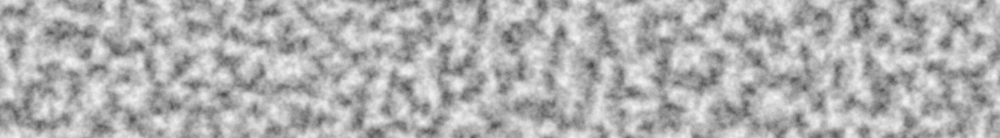

# Noiz

A simple, configurable, blazingly fast noise library built for and with [Bevy](https://bevyengine.org/).

Here's some fbm simplex noise as a taste:

Noiz is:
- Simple
- Extendable
- Blazingly fast (meant for realtime use)
- Easy to use in Bevy
- Built in pure rust
- Consistent between platforms (with a feature flag)
- Serializable
- Reflectable
- Readable
- Under development (as I have time and features are requested)
- Free and open source forever (feel free to open issues and prs!)
- No Std compatible

Noiz is not:
- Spelled correctly (noise was already taken)
- Mathematically precise (only supports `f32` types for now)
- Fully optimized yet (algebraic float math is not stable in rust yet)
- Meant to replace art tools for asset generation
- Meant to be standalone (you'll want to also depend on either `bevy_math` or `bevy`.)

| Bevy version | noiz version |
|--------------|--------------|
| 0.16         | 0.1, 0.2 |

## What Makes Noiz Unique?

- Noiz is powered by a custom random number generator built on a hash function instead of the traditional permutation table.
  This gives competitive performance while using less memory and reducing tiling artifacts.
- Noiz seamlessly integrates with Bevy!
- Noiz changes seed automatically between octaves (which prevents some artifacting common in other libraries).
- Noiz is endlessly cusomizable. Really, the combinations and settings are limitless!
- Noiz is `no_std`.
- Noiz supports all your favorite noise types. If you see one that's missing, please open an issue!
- Noiz supports noise derivatives and gradiesnts, allowing fast erosion approximations, analytical normals, etc.
- Noiz supports many noise types that other libraries do not, for example, distance-to-edge worly noise and smooth worly noise.
- Noiz has good documentation and a [book](https://elliottjpierce.github.io/noiz/).
- Noiz is faster than many other libraries.

## For a Quick Start, Check Out the Book!

In addition to rust docs, Noiz has a book available [here](https://elliottjpierce.github.io/noiz/).
This explains how to use Noiz in practice with much more detail than the API reference.
