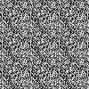
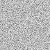

# Comparing to Other Libraries

> Disclaimer: I don't maintain these other projects.
There may have been updates, etc, or there may be other ways to improve their performance from a user's perspective.
If you see a way to represent them more fairly, feel free to submit a PR!

## Quick Facts

| Feature               | Noiz        | Noise        | libnoise       | fastnoise_lite  |
|-----------------------|-------------|--------------|----------------|-----------------|
| precision             | `f32`       | `f64`        | `f64`          | `f32`           |
| dimensions            | 2d, 3d, 4d  | 2d, 3d, 4d   | 1d, 2d, 3d, 4d | 2d, 3d,         |
| customizability       | total       | some         | some           | limited choices |
| cross-language        | ❌           | ❌            | ❌              | ✅              |
| no-std                | ✅          | ✅          | ❌              | ✅              |
| overall performance   | Great       | Poor         | Great          | Good            |
| overall noise quality | Good        | untested     | Ok for small domains | Ok              |

(If you want *great* noise quality, use an art application like blender.)

## Benchmarks

All benchmarks are on a standard M2 Max with the same build configuration recommended above.

Each dimension's benchmarks contain roughly the same number of samples.

All benchmarks are as even as possible. For example, they all do smoothstep interpolation, default seeding, etc.

Only a few combinations of noiz's types are benched. If you are creating your own noise functions, it will always be best to create your own benchmarks for your own specific uses.

### 2D

Time (milliseconds) per 1024 ^ 2 = 1048576 samples. Lower is better.

| Noise Type            | noiz        | noise        | libnoise       | fastnoise_lite  |
|-----------------------|-------------|--------------|----------------|-----------------|
| value                 | 1.7365   ✅ | 3.1          | 1.8831      ✅ | 14.8            |
| value fbm 2 octave    | 7.1         | 8.6          | 5.8         ✅ | 31.4            |
| value fbm 8 octave    | 29.5        | 33.4         | 22.0        ✅ | 112.0           |
| perlin                | 3.4      ✅ | 8.8          | 3.0         ✅ | 8.1             |
| perlin fbm 2 octave   | 8.6      ✅ | 18.4         | 8.1         ✅ | 17.2            |
| perlin fbm 8 octave   | 36.7        | 71.8         | 31.1        ✅ | 58.0            |
| simplex               | 7.0      ✅ | 8.6          | 8.1            | 10.6            |
| simplex fbm 2 octave  | 14.7     ✅ | 22.3         | 17.7           | 21.6            |
| simplex fbm 8 octave  | 57.8     ✅ | 108.5        | 89.2           | 116.0           |
| worley                | 5.7      ✅ | 24.5         | 11.8           | 17.8            |
| worley approximate    | 2.8      ✅ | ---          | ---            | ---             |

Note that "worley approximate" is a faster version of "worley" with some compromises.

### 3D

Time (milliseconds) per 101 ^ 3 = 1030301 samples. Lower is better.

| Noise Type            | noiz        | noiz `Vec3A` | noise          | libnoise        | fastnoise_lite  |
|-----------------------|-------------|--------------|----------------|-----------------|-----------------|
| value                 | 3.0         | 7.8          | 11.4           | 2.7          ✅ | 39.6            |
| value fbm 2 octave    | 13.2        | 16.0         | 22.5           | 8.2          ✅ | 85.7            |
| value fbm 8 octave    | 56.8        | 60.7         | 89.3           | 33.5         ✅ | 336.6           |
| perlin                | 7.1         | 11.4         | 76.9           | 6.4          ✅ | 13.8            |
| perlin fbm 2 octave   | 17.4        | 23.0         | 28.5           | 15.8         ✅ | 29.7            |
| perlin fbm 8 octave   | 76.4        | 86.4         | 368.9          | 69.7         ✅ | 132.0           |
| simplex               | 12.9     ✅ | 17.6         | 14.2           | 16.3            | 20.1            |
| simplex fbm 2 octave  | 27.3     ✅ | 33.5         | 51.8           | 25.9         ✅ | 43.0            |
| simplex fbm 8 octave  | 108.7    ✅ | 129.8        | 207.8          | 181.7           | 175.1           |
| worley                | 54.8        | 57.4         | 78.9           | 52.9            | 42.3         ✅ |
| worley approximate    | 6.2      ✅ | 14.9         | ---            | ---             | ---             |

`Vec3A` is an aligned 3d type from `bevy_math` (glam). It enables SIMD instructions, but uses more memory to do so.
As you can see, it's not worth it here.

### 4D

Time (milliseconds) per 32 ^ 4 = 1048576 samples. Lower is better.

| Noise Type            | noiz        | noise        | libnoise       | fastnoise_lite  |
|-----------------------|-------------|--------------|----------------|-----------------|
| value                 | 13.8        | 21.2         | 3.9         ✅ | ---             |
| value fbm 2 octave    | 27.7        | 46.0         | 14.3        ✅ | ---             |
| value fbm 8 octave    | 109.0       | 167.3        | 57.3        ✅ | ---             |
| perlin                | 17.5     ✅ | 177.6        | 17.6        ✅ | ---             |
| perlin fbm 2 octave   | 38.3     ✅ | 53.5         | 38.4        ✅ | ---             |
| perlin fbm 8 octave   | 146.1    ✅ | 824.2        | 203.1          | ---             |
| simplex               | 18.8     ✅ | 35.5         | 29.5           | ---             |
| simplex fbm 2 octave  | 36.6     ✅ | 108.8        | 41.0           | ---             |
| simplex fbm 8 octave  | 139.3    ✅ | 421.0        | 234.4          | ---             |
| worley                | 186.8       | 156.3     ✅ | 205.8          | ---             |
| worley approximate    | 26.3     ✅ | ---          | ---            | ---             |

### Summary

For value noise, `libnoise` is the clear winner for performance.
Both `fastnoise_lite` and `noise` are far behind. `noiz` is close, but not quite as fast.
This is because `libnoise` uses a permutation table for it's rng where `noiz` uses a custom hash function.
This mean two things:
First, `libnoise` will invalidate a cache line, which is not reflected in these benches since nothing was competing for the cache.
Second, `libnoise` will produce repeating noise from far away.

See the tiling? This is at a frequency of 200.
By contrast, here's `noiz` at a frequency of 1024:

No tiling. Yay!
Note that some artifacting (not quite tiling) does happen at excessively large scales.
But that's not a big deal in practice. (Ever wonder why the far lands exist in minecraft?)

For perlin noise, `noiz` and `libnoise` roughly tie for 2d; `noiz` is faster for 4d but `libnoise` just beats it for 3d.
This is likely also due to the difference in rng methods, and the same quality issues and benchmark blind spots apply here too.

For simplex noise, `noiz` is the clear winner. Simplex is about half as fast as perlin for 2d, but it gets better for higher dimensions, beating perlin in 4d.

For Worley noise, the results vary greatly depending on use-case. See for yourself.

## What to Choose

Use `fastnoise_lite` if you need consistncy across languages.
Use `libnoise` if you don't need a ton of configuration, are using relatively small domains, and are primarily doing value and perlin noise.
If you absolutely need `f64` support, use `libnoise`, but again, the permutation table rng makes the large domain kinda a moot point. Same goes for `noise`.
If you are integrating with `bevy`, need lots of customization, need general, high performance, or need serialization and reflection, use `noiz`.
I am not aware of a reason to use `noise` (though there may well be one I'm missing).
