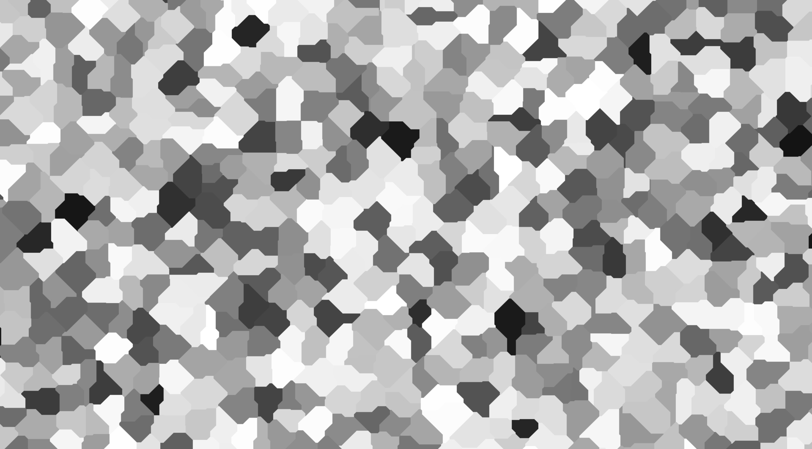
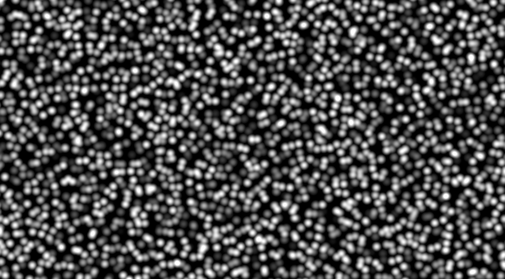

# Distance Noise

Mixing and blending is not the only way to smooth out rough white noise.
When thinking about how to smooth it out, another idea you might have had is to pick some point in each cell and generate values based on that point instead of the whole cell.
Then, you could return results based on the sample's location relative to those points instead of just what cell it lands in.
This is considered distance noise since it is ultimately always tied to the distance between points.

## Cellular Noise

Let's start simple.
For each sample location, first, find it's domain cell, then find the nearest corner of that cell, then generate a value based on that corner.
This is called cellular noise because it ends up creating "cells" of values.
These cells are not to be confused with domain cells from a `Partitioner`; you can think of them as a desirable side affect of the algorithm
Here's how to do cellular noise in noiz:

```rust
use noiz::prelude::*;
use bevy_math::prelude::*;
let noise = Noise::<PerNearestPoint<
    SimplexGrid,
    EuclideanLength,
    Random<UNorm, f32>,
>>::default();
let value: f32 = noise.sample(Vec2::new(1.5, 2.0));
```

Here, `PerNearestPoint` is told to find the cell of the sample via `SimplexGrid`,
find the nearest corner of that cell via the distance function `EuclideanLength`,
and generate a value there via `Random<UNorm, f32>`.
This produces:


The affect is a little underwhelming with `OrthoGrid` since it still produces squares, but we're not done here.
Another idea is to give each of those square corners a little nudge in some direction.
This produces a voronoi grid, which is more rigorously defined [here](https://en.wikipedia.org/wiki/Voronoi_diagram).
For our purposes, it just makes the noise much more interesting.
Replacing `SimplexGrid` with `Voronoi` produces:


Cool! See the [docs](https://docs.rs/noiz/latest/noiz/cells/struct.Voronoi.html) for more configuration here, like how much to nudge each point.
This is the typical cellular noise.
If you've heard of cellular noise before, this is probably what it referred to.

There's lot's more than just `EuclideanLength`, too.
Here's a look at the shapes they produce in a [distance field](https://www.slideserve.com/nuru/gpgpu-distance-fields-powerpoint-ppt-presentation),
the general shape in which the distance between two points change.

- `EuclideanLength`: produces circles
- `EuclideanSqrdLength`: produces circles with non-linear scaling
- `ManhattanLength`: produce diamonds
- `HybridLength`: combines `EuclideanLength` and `ManhattanLength`, producing diagonal shapes
- `ChebyshevLength`: produce squares
- `MinikowskiLength`: produce concave diamonds, like stars

Here's a look at using `ManhattanLength`:



## Worley Noise

In cellular noise, each cell is flat since it only comes from the nearest cell point itself.
So, another approach is to calculate the result based on the distances themselves rather that the *point* at the closest distance.
This is called worley noise.
Here's how to do it in noiz:

```rust
use noiz::prelude::*;
use bevy_math::prelude::*;
let noise = Noise::<PerCellPointDistances<
    Voronoi,
    EuclideanLength,
    WorleyLeastDistance,
>>::default();
let value: f32 = noise.sample(Vec2::new(1.5, 2.0));
```

Here, `PerCellPointDistances` is told to calculate noise based on the sample location's distance as defined by `EuclideanLength` to nearby points from the `Voronoi` partitioner,
where those distances are turned into a result via `WorleyLeastDistance`.
`WorleyLeastDistance` is a `WorleyMode` that does exactly what it says: returns the least distance, between 0 and 1 of course.
Here's what that looks like:


This is traditional worley noise.
If you've heard of it before, this is probably what it meant.
But `WorleyLeastDistance` is not the only kind of worley noise.
Here's some more, all using `EuclideanLength`.

- `WorleySmoothMin<CubicSMin>`: 
There are other smooth min functions besides `CubicSMin`, but only this one is included in noiz.
(But you can always make your own!)
This is very similar to `WorleyLeastDistance`, but instead of retaining boarders between cells,
this smooths those out completely, instead creating "pit" artifacts.
- `WorleyAverage`: 
- `WorleyDifference`: 
- `WorleyRatio`: 
- `WorleyProduct`: 
- `WorleySecondLeastDistance`: 

One other option is to calculate the distance to the edge between the voronoi cells.
This is implemented slightly differently:
```rust
use noiz::prelude::*;
use bevy_math::prelude::*;
let noise = Noise::<DistanceToEdge<Voronoi>>::default();
let value: f32 = noise.sample(Vec2::new(1.5, 2.0));
```
It produces this: 

There's not nearly enough space to give all length-mode combinations, but here's one more:

This is `WorleyAverage` with `ChebyshevLength`.

## Voronoi Blending

Of course, you can still blend over `Voronoi`.
Here's one example:

```rust
use noiz::prelude::*;
use bevy_math::prelude::*;
let noise = Noise::<BlendCellValues<
    Voronoi,
    SimplecticBlend,
    Random<UNorm, f32>,
>>::default();
let value: f32 = noise.sample(Vec2::new(1.5, 2.0));
```

This makes: 

There's also `DistanceBlend<T>`, where `T` is a length function as an alternative to `SimplecticBlend`.
Using `DistanceBlend<ManhattanLength>` for example makes:


You can also blend gradients:

```rust
use noiz::prelude::*;
use bevy_math::prelude::*;
let noise = Noise::<BlendCellGradients<
    Voronoi,
    SimplecticBlend,
    QuickGradients,
>>::default();
let value: f32 = noise.sample(Vec2::new(1.5, 2.0));
```

This produces: 
Pretty cool!

---

For more information about how voronoi and worley noise works (and noise in general), check out [this](https://iquilezles.org/articles/) website.
