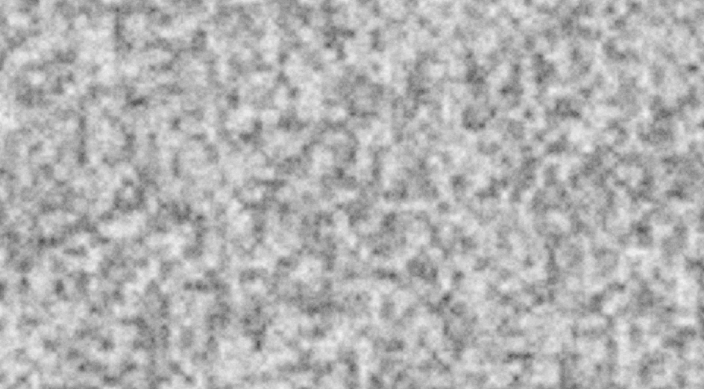

# Layered Noise

In the last two chapters, we covered all the major noise algorithms.
Despite some pretty cool outputs, all the noise is still roughly the same.
The noise is smooth, flowing, and organic, but it doesn't have much variation.
So, how do we add more variation?
If you imagine each noise algorithm as a dice to roll, one thing you may think of is to just roll more dice!
That's the idea behind layered noise.

## Interface

Layered noise is much more complex than other noise functions, so let's take a tour of the most important types.

```rust
use noiz::prelude::*;
use bevy_math::prelude::*;
let noise = Noise::<LayeredNoise<
    Normed<f32>,
    Persistence,
    Octave<MixCellGradients<
        OrthoGrid,
        Smoothstep,
        QuickGradients,
    >>,
>>::default();
let value: f32 = noise.sample(Vec2::new(1.5, 2.0));
```

Here, the noise function for `Noise` is `LayeredNoise`, which is generic over a three types.
First, we need to tell it what to do with all these layers of noise.
The most common option is `Normed<T>`, which will add up different values of `T` from the layers of noise, and normalize it to the widest range of outputs of its layers, usually UNorm or SNorm.
Next, we need to tell it how to weight each layer of noise.
The most common for this is `Persistence`, which makes layers have progressively different contributions to the output.
By default, this will makes later noise layers "persist" exponentially less than earlier ones.
Finally, we need to actually give it the layers.
Here, we use only one layer: `Octave`.
An `Octave` is just a layer of noise that contributes directly to the output.
There are more kinds of octaves too, but we'll cover those later.
Each `Octave` also needs its own generic parameter, which determines which `NoiseFunction` to use.
Here, we use perlin noise.

All of that is great, but the above code actually just makes standard perlin noise.
That's because we only gave it one octave.
To add more octaves, they are listed in tuples.
For example, `(Layer1, Layer2, Layer3)` is itself a layer that runs `Layer1`, then `Layer2`, and then `Layer3`.
This is only implemented for a finite combination of tuples.
If the tuple gets too big, you'll need to nest them, which has the same affect: `(Layer1, (Layer2, Layer3))`.
That lets us make this:

```rust
use noiz::prelude::*;
use bevy_math::prelude::*;
let noise = Noise::<LayeredNoise<
    Normed<f32>,
    Persistence,
    (
        Octave<MixCellGradients<
            OrthoGrid,
            Smoothstep,
            QuickGradients,
        >>,
        Octave<MixCellGradients<
            OrthoGrid,
            Smoothstep,
            QuickGradients,
        >>,
        Octave<MixCellGradients<
            OrthoGrid,
            Smoothstep,
            QuickGradients,
        >>,
    ),
>>::default();
let value: f32 = noise.sample(Vec2::new(1.5, 2.0));
```

Tada! now we have 3 octaves of perlin noise.
Here's what that looks like:


For contrast, here's just one layer again:


Maybe the layered one is a bit softer, has a few more details, etc, but it's not much better.
Let's fix that!

## Fractal Layers

The problem is that each layer of noise remains the same scale.
This does increase the variation of the noise, but it doesn't have a sense of "depth".
Since everything is happening at the same scale, you don't get small details on big features–just more varied big features.
Let's fix this by making layers fractal:

```rust
use noiz::prelude::*;
use bevy_math::prelude::*;
let noise = Noise::<LayeredNoise<
    Normed<f32>,
    Persistence,
    FractalLayers<Octave<MixCellGradients<
        OrthoGrid,
        Smoothstep,
        QuickGradients
    >>>,
>>::default();
let value: f32 = noise.sample(Vec2::new(1.5, 2.0));
```

Here, `FractalLayers` repeats its inner layer some number of times (by default, 8), scaling the noise between each repetition.
When used with `Normed` and `Persistence`, this is called fractal brownian motion (fbm), and it produces this:


Very nice!

Here's the same thing with simplex noise:


And with value noise:



Fbm noise is so common, it has a type alias in `prelude::common_noise`.

## Configuring Noise

There's lots of options for how to configure all the noise types we've covered, but it's especially fun to do so with fbm noise.
So, how do you specify settings in `Noise`.
`Noise<T>` implements `From<T>`, so all you need to do is construct it from the inner `NoiseFunction`.
Here's that same fbm perlin noise constructed this way:

```rust
use noiz::prelude::*;
use bevy_math::prelude::*;
let noise = Noise::from(LayeredNoise::new(
    Normed::default(),
    Persistence(0.5),
    FractalLayers {
        // The layer to do fbm with
        layer: Octave::<MixCellGradients<
            OrthoGrid,
            Smoothstep,
            QuickGradients
        >>::default(),
        // How much to change the scale by between each repetition of the layer
        lacunarity: 2.0,
        // How many repetitions to do
        amount: 8,
    },
));
let value: f32 = noise.sample(Vec2::new(1.5, 2.0));
```

Note that `LayeredNoise` must be constructed through `new`, and changing it after construction is forbidden.
This is because `new` actually precomputes a small but meaningful portion of the work, which would be made invalid by changing the setting after the fact.
