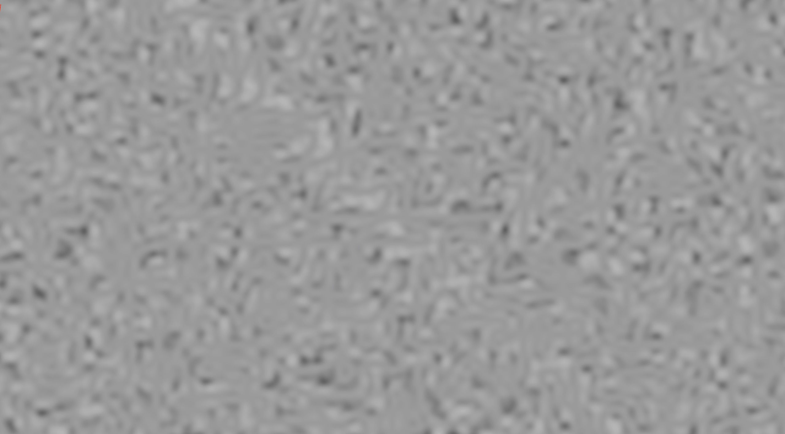

# Modifiers

Up until now, we've only been making, layering, and differentiating the major noise algorithms.
But usually, that isn't enough to achieve the desired artistic affect.
That's where modifiers come in.

## What Are Modifiers?

There isn't a strict definition for what modifiers are, but in general, modifiers are noise functions operate on the outputs of other noise functions rather than generating their own.
For example, noiz has a `Pow4` type, which raises whatever input it is fed to the fourth power.
Modifiers like those are composed together in tuples.
For example, `(PerCellPointDistances<Voronoi, EuclideanLength, WorleyLeastDistance>, Pow4)` is a noise function that will first compute worley noise before raising the output to the fourth power.
Note that, like layers, this is only implemented for tuples up to a certain length.
But you can still nest them: ex: `(F1, F2, F3)` is the same as `(F1, (F2, F3))`.
Other modifiers are composed.
For example `SelfMasked<PerCellPointDistances<Voronoi, EuclideanLength, WorleyLeastDistance>>` will compute two different worley values and multiply them together.

Each modifier is also a noise function itself, which can be modified too.
Modifiers can be composed on themselves and each other to create endless customizations!

## Changing Ranges

Different noise functions produce different ranges of results.

- Gradient-based noise (`MixCellGradients` and `BlendCellGradients`) produce SNorm values (-1 to +1).
- Distance-based noise (`PerCellPointDistances` and `DistanceToEdge`) produce UNorm values (0 to 1).
- Value-based noise is customizable through generic parameters, ex: `Random<UNorm, f32>`.
- Layered noise inherits the widest range of its octaves.

But what if you want perlin noise in UNorm range instead of SNorm?
That's easy with modifiers!
Just use `(MySNormNoise, SNormToUNorm)`.
The inverse is also possible with the creatively named `UNormToSNorm`.
This is used extensively in noiz examples to display images, which need UNorm pixels.

## Survey of Common Modifiers

There is no way to cover all the different modifiers and their combinations, but I'll list some common ones.

Billowing and ping-ponging are kinda opposites of each other.
Here's fbm billowing simplex noise:

```rust
use noiz::prelude::*;
use bevy_math::prelude::*;
let noise = Noise::<LayeredNoise<
    Normed<f32>,
    Persistence,
    FractalLayers<
        Octave<(
            BlendCellGradients<
                SimplexGrid,
                SimplecticBlend,
                QuickGradients,
            >,
            Billow,
        )>,
    >,
>>::default();
let value: f32 = noise.sample(Vec2::new(1.5, 2.0));
```

Notice how the `Billow` is inside of the octave.
If it were outside, it would billow the whole result, instead of each octave.
The above produce this image:


Another common operation is masking (multiplying) noise together:
Sample a noise function in the same place, but with different seeds, and multiply the results.
Here's how to do that with `SelfMasked`:

```rust
use noiz::prelude::*;
use bevy_math::prelude::*;
let noise = Noise::<SelfMasked<(
    LayeredNoise<
        Normed<f32>,
        Persistence,
        FractalLayers<
            Octave<
                BlendCellGradients<
                    SimplexGrid,
                    SimplecticBlend,
                    QuickGradients,
                >,
            >,
        >,
    >,
    SNormToUNorm,
)>>::default();
let value: f32 = noise.sample(Vec2::new(1.5, 2.0));
```

Notice that this time, `SelfMasked` is outside the `LayeredNoise`.
Putting it inside is not wrong, but it produces a different affect.
Notice also that before masking, we use `SNormToUNorm`.
This prevents one noise function's result from inverting the other.
Allowing that isn't wrong either, it just makes a different result.
Anyway, here's what this makes:


We can also mask different kinds of noise together:

```rust
use noiz::prelude::*;
use bevy_math::prelude::*;
let noise = Noise::<Masked<
    MixCellGradients<OrthoGrid, Smoothstep, QuickGradients>,
    BlendCellGradients<SimplexGrid, SimplecticBlend, QuickGradients>,
>>::default();
let value: f32 = noise.sample(Vec2::new(1.5, 2.0));
```

Here, perlin and simplex noise are masked together, producing:



I wonder what worley noise masked with value noise would look like...

Raising noise to a power is also common to exaggerate its affects.
Here's what that looks like with perlin noise:

```rust
use noiz::prelude::*;
use bevy_math::prelude::*;
let noise = Noise::<(
    MixCellGradients<OrthoGrid, Smoothstep, QuickGradients>,
    Pow4,
)>::default();
let value: f32 = noise.sample(Vec2::new(1.5, 2.0));
```

Which makes:


## Many More

This is by no means a complete list.
Check out the [docs](https://docs.rs/noiz/latest/noiz/index.html) for many, many more,
or modify an example to see it in action.
