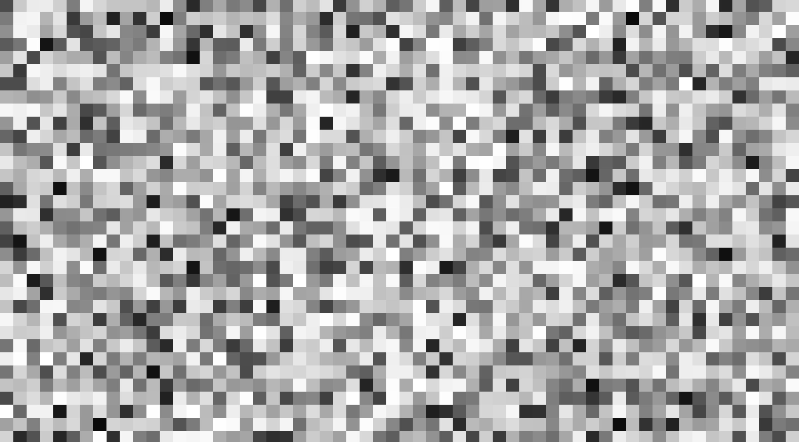
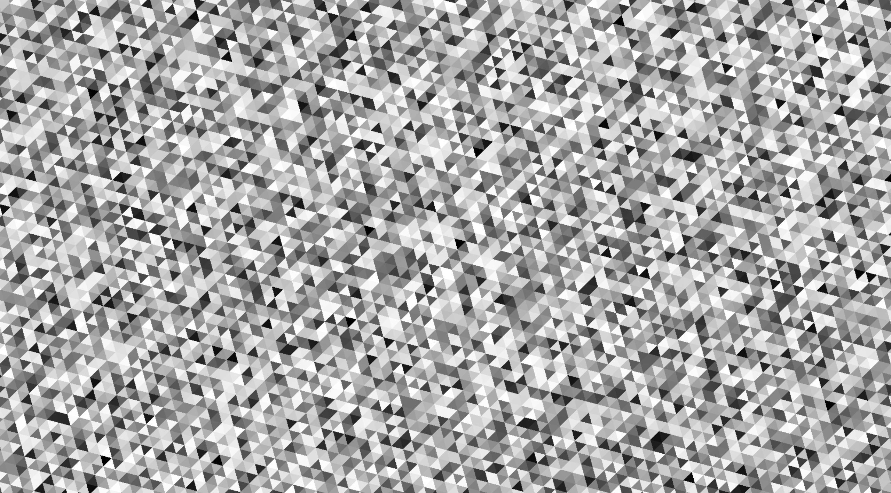
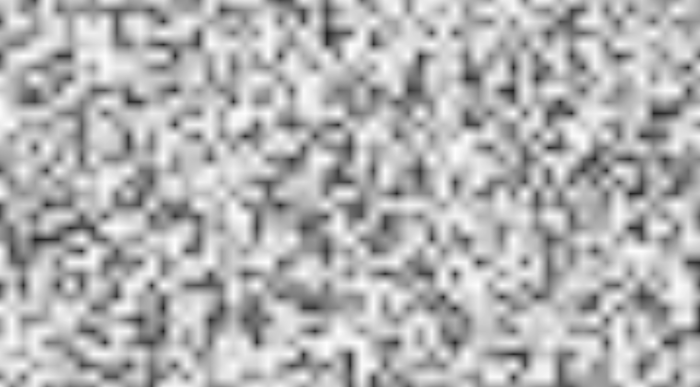
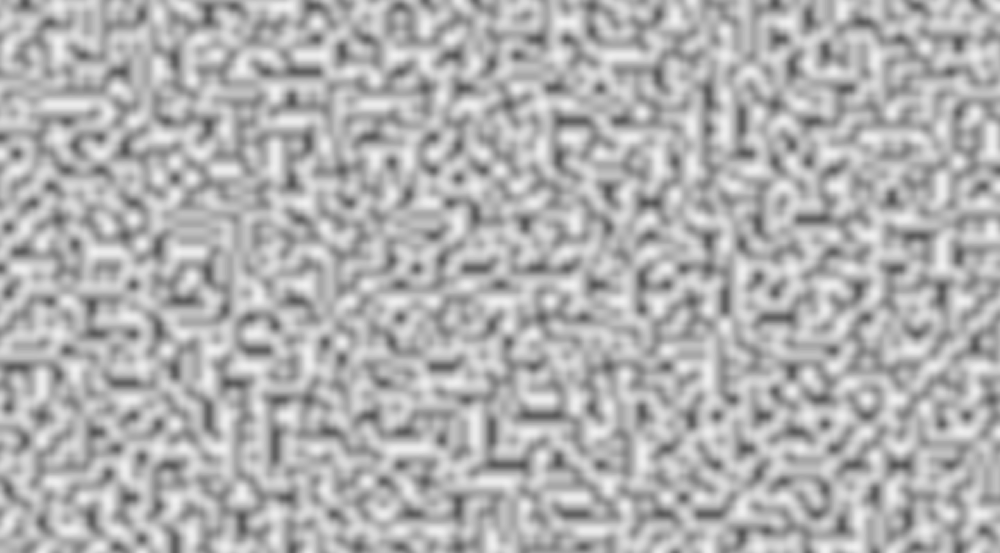
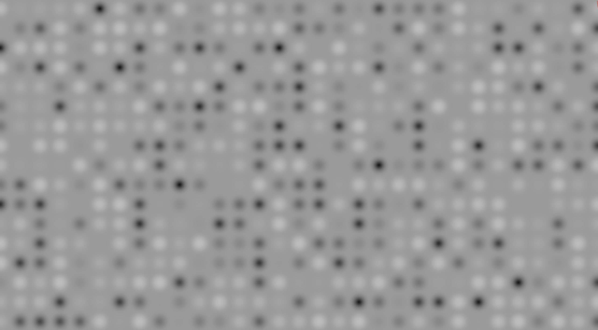
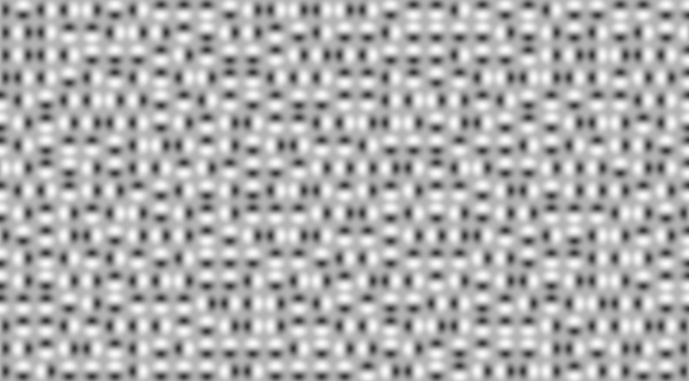
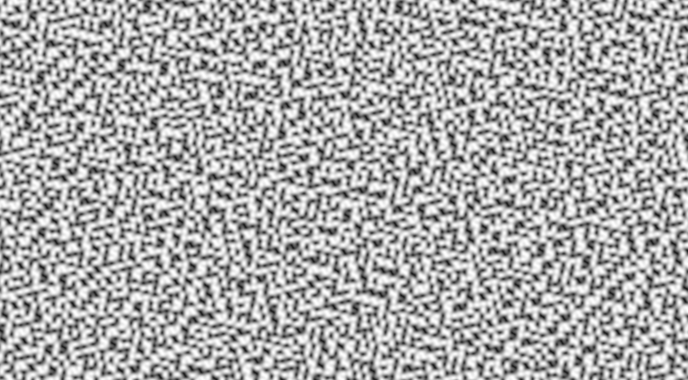

# Smooth Noise

Not all noise is smooth.
In this chapter, we'll explore smooth noise in noiz.

## White Noise

Let's remind ourselves of what we made:

```rust
use noiz::prelude::*;
use bevy_math::prelude::*;
let noise = Noise::<PerCell<OrthoGrid, Random<UNorm, f32>>>::default();
let value: f32 = noise.sample(Vec2::new(1.5, 2.0));
```

For now, I'll omit setting the seed and scale of the noise, so we can just focus on the algorithms.

This is white noise, but what does it look like?
One of the common ways to get an idea of how a noise algorithm behaves is to visualize it's results as a color from black to white.
Then, make an image using noise samples as the pixel values.
That let's us visualize this noise as:



We could have also used triangular cells via `SimplexGrid`.
Just like `OrthoGrid` is built on orthogonal primitives (squares, cubes, etc), `SimplexGrid` is built on simplex primitives (triangles, tetrahedrons, etc).
Using `SimplexGrid` instead of `OrthoGrid` would produce:



But for now, let's focus on squares.

Anyway, this is white noise, and it's not usually very useful.
There's no form or flow to it; it's random, but it's certainly not very natural or organic looking.
Put another way, this noise is rough, but we want smooth noise.

> Note that, due to compression, not all details of noise may be clear on these images.
And, to prevent a large download size, not all noise combinations will have an image.
There's simply too many combinations of noise settings, which is a good problem to have!
Also, the scale of the noise may change between images to better show detail, etc.

## Value Noise

If you were tasked with making this rough noise smoother, how would you approach it?
One way you might think of is to blur the lines between the squares.
That's values noise!

Basically, instead of picking a value for each domain cell, pick one for each corner of the domain cell, and mix those values together across the cell.
If that didn't make sense, see a visual explanation [here](https://www.youtube.com/watch?v=DxUY42r_6Cg&t=619s), which covers both value and perlin noise; more on perlin in a bit.
This is called [bilinear interpolation](https://en.wikipedia.org/wiki/Bilinear_interpolation).
In noiz, we call this mixing, as it is generalized for squares, cubes, and hyper cubes.

```rust
use noiz::prelude::*;
use bevy_math::prelude::*;
let noise = Noise::<MixCellValues<
    OrthoGrid,
    Linear,
    Random<UNorm, f32>,
>>::default();
let value: f32 = noise.sample(Vec2::new(1.5, 2.0));
```

Here, `MixCellValues` is told to mix values over each domain cell, sourced from `OrthoGrid`, by the `Linear` curve, where each value comes from `Random<UNorm, f32>`.

> Note that `MixCellValues` only really works with `OrthoGrid` variants (more on those later) or a custom `Partitioner` you make.
It is possible to implement mixing for other shapes, but they are not worth it for the runtime cost.

Regardless, values noise produces this:



But what are all those harsh lines doing in the noise?
Sometimes, that's what you want; most of the time, you want smoother.
Thankfully, there's a curve for that.
Changing `Linear` to `Smoothstep`, unsurprisingly, makes the image smoother:


This is traditional value noise.
It's so common, noiz provides a type alias for it in `prelude::common_noise`.

This generic curve parameter runs on `bevy_math`'s [`Curve`](https://docs.rs/bevy/latest/bevy/math/trait.Curve.html) trait,
so you can also use ones in their library or make you're own.
Depending on what you want, `Smoothstep` is almost always the right choice for mixing.
Though, sometimes `Linear` or a custom curve is artistically appealing.

> When picking the curve, keep in mind that the more derivatives that can be taken from a curve, the smoother the result generally appears.
For example, `Linear` produces harsh changes in the noise, as you saw.
Then, `Smoothstep` eliminated those abrupt changes, but the derivative of the noise, how the value is changing, still has sharp changes of it's own!
When you care about the smoothness of the derivative of noise, you may want to use a smoother curve.
For that, noiz also provides `DoubleSmoothstep`, `Smoothstep` composed on itself.

## Perlin Noise

Maybe you weren't satisfied with the value noise.
Sure, it's better than white noise, but it's still pretty recitative.
I mean, the values are random and smooth, but the shapes are still easy to spot.
It's just a bunch of blurry squares!

That's where perlin noise comes in!
Instead of mixing *random* values over a domain cell, source those values partly from the sample location and partly from a random unit vector.
That probably won't make sense at first (and that's ok).
If you want a visual explanation, see [here](https://www.youtube.com/watch?v=DxUY42r_6Cg&t=619s) again.
Ultimately, since the sample location has more effect, this adds lots more shapes to the noise.
Here's how this works in noiz:

```rust
use noiz::prelude::*;
use bevy_math::prelude::*;
let noise = Noise::<MixCellGradients<
    OrthoGrid,
    Smoothstep,
    QuickGradients,
>>::default();
let value: f32 = noise.sample(Vec2::new(1.5, 2.0));
```

Here, `MixCellGradients` is told to mix those unit vector + sample location combinations over domain cells from `OrthoGrid`, via the `Smoothstep` curve.
Those unit vectors are called gradients, and we specify how to make them, here with `QuickGradients`.
Usually `QuickGradients` is the right choice; it provides fast, decent gradients.

> Any time this "random unit vector combined with sample location" trick is used, it's called gradient noise, since it comes from, well, gradients.
Noise that just merges random values directly is generally called value noise, even if it isn't the traditional value noise described above.



Isn't that nice?
This is so common, it has a type alias for it in `prelude::common_noise`.

Perlin noise isn't perfect.
If you look closely, you'll see directional artifacts: places that seem to form lines together.
This isn't always a big deal, but it can be minimized with other gradient generators that sacrifice speed for quality.
Some of these are also provided in `Noiz`, with various trade-offs.
See [here](https://docs.rs/noiz/latest/noiz/cell_noise/trait.GradientGenerator.html#implementors).

> Perlin noise mixes values, just like value noise, so the same restrictions on `Partitioner`s apply here too.
Additionally, the same configuration operations for the curve apply here too: `DoubleSmoothstep` may sometimes be needed, and `Linear` will produce rougher noise.

## Simplex Noise

Even with a high quality gradient generator, perlin noise can and will generate directional artifacts from time to time.
Usually, this isn't a big deal; sometimes, it's even desirable—but not always.
In those cases, simplex noise is the solution.

Instead of being based on squares, it's based on triangles.
This eliminates straight linear artifacts, though some zig-zagy ones may remain.
Still, that's about as good as one can ask for.

One issue with using triangles is that it's very inefficient to mix values over them.
Instead, simplex noise blends values.
What's the difference?
Think of it like this: mixing is like a movie blurring to transition between two scenes; blending is like the movie fading to black from one scene before fading from black to a new scene.
It's an imperfect analogy, but hopefully it gives you an idea.
If you want the details, check out [this](https://muugumuugu.github.io/bOOkshelF/generative%20art/simplexnoise.pdf) paper.

Before jumping into simplex, here's what blending cell values looks like instead of mixing them:

```rust
use noiz::prelude::*;
use bevy_math::prelude::*;
let noise = Noise::<BlendCellValues<
    OrthoGrid,
    SimplecticBlend,
    Random<UNorm, f32>,
>>::default();
let value: f32 = noise.sample(Vec2::new(1.5, 2.0));
```

Here, `BlendCellValues` is told to blend values from `Random<UNorm, f32>` between the points of domain cells from `OrthoGrid`.
Of course, we also must specify how to blend them.
The simplest, and usually the best, blender is `SimplecticBlend`.
It produces pleasing, round results, but there are other blenders too, which we'll see later in the book.
This produces:



Wow, we're back to the same repetitiveness from value noise.
But we don't want value noise, we want gradient noise!
Here's blended gradient noise on a square grid:

```rust
use noiz::prelude::*;
use bevy_math::prelude::*;
let noise = Noise::<BlendCellGradients<
    OrthoGrid,
    SimplecticBlend,
    QuickGradients,
>>::default();
let value: f32 = noise.sample(Vec2::new(1.5, 2.0));
```

This produces:



Well, that's better, but it still has those grid lines!
Now for the last step: using triangles to remove grid lines via `SimplexGrid`.

Here's it at work:

```rust
use noiz::prelude::*;
use bevy_math::prelude::*;
let noise = Noise::<BlendCellGradients<
    SimplexGrid,
    SimplecticBlend,
    QuickGradients,
>>::default();
let value: f32 = noise.sample(Vec2::new(1.5, 2.0));
```

The above produces:



Tada!
Traditional simplex noise.
This is also so common that it has a type alias in `prelude::common_noise`.
Simplex noise still isn't perfect, but it is more than good enough in practice.

---

It might surprise you, but value, perlin, and simplex noise are not the only ways to smooth out white noise.
Let's look at another...
