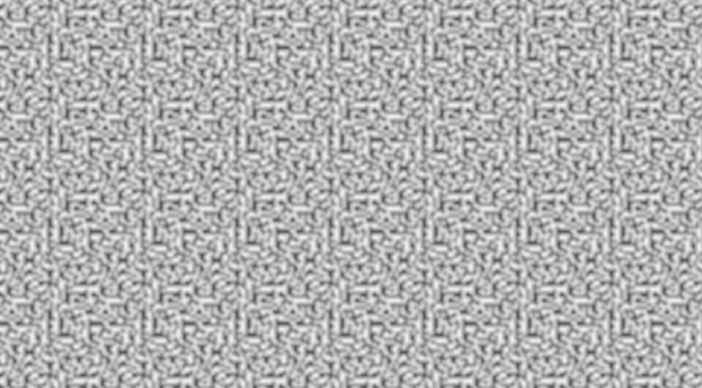
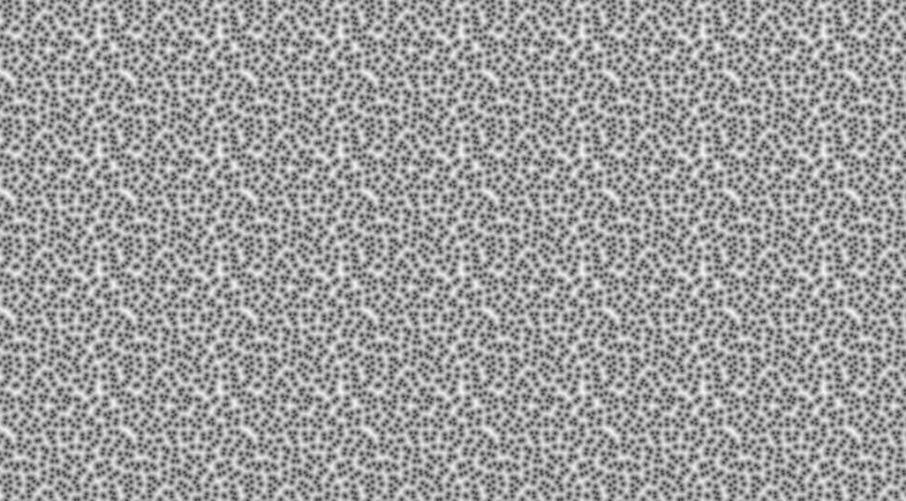

# Special Partitioning

We've looked so far at `OrthoGrid`, `SimplexGrid` and `Voronoi` partitioners, but there's actually even more options here.

## Voronoi

The `Voronoi` graph is just a grid that has been nudged around a bit.
As has been noted, you can customize how much it nudges the grid around,
but you can also turn on a flag that approximates the graph.
This is not a perfect approximation.
It has artifacts when paired with `WorleyMode`s that need more than just the nearest point,
and it is significantly less random than a normal `Voronoi` graph.
But, it is *much* faster.
You can enable it with a flag (off be default): `Voronoi<true>`.

Also, you can configure which grid `Voronoi` is nudging around.
It is `OrthoGrid` by default, but you can make your own too!

> Note that `SimplexGrid` will work, but not with `PerCellPointDistances`.
This is because the domain cell it produces can't implement [`WorleyDomainCell`](https://docs.rs/noiz/latest/noiz/cells/trait.WorleyDomainCell.html),
which is needed for it to work.

## OrthoGrid

`OrthoGrid` is actually generic over a [`WrappingAmount`](https://docs.rs/noiz/latest/noiz/cells/trait.WrappingAmount.html), which is the unit type (no wrapping) by default.
However, you can use `OrthoGrid<i32>` for example to wrap noise generated on that grid.
Vector types also work for making rectangles of wrapping noise.
You can also make your own wrapping amounts.
This is very useful if you want the result to tile.

Here's an example of wrapping perlin noise:

```rust
use noiz::prelude::*;
use bevy_math::prelude::*;
let noise = Noise::from(
    MixCellGradients {
        // Wrap after 16 units.
        cells: OrthoGrid(16),
        gradients: QuickGradients,
        curve: Smoothstep,
    }
);
let value: f32 = noise.sample(Vec2::new(1.5, 2.0));
```

The above produces:



> Note that `SimplexGrid` doesn't tile in rectangles, so it is not generic over a `WrappingAmount`.

You can also make tiling worley noise!

```rust
use noiz::prelude::*;
use bevy_math::prelude::*;
let noise = Noise::<PerCellPointDistances<
    // We need to specify that we don't want approximation,
    // so we can set the custom grid to warp.
    Voronoi<false, OrthoGrid<i32>>,
    EuclideanLength,
    WorleyLeastDistance,
>>::from(
    PerCellPointDistances {
        // Wrap after 16 units.
        cells: Voronoi {
            partitoner: OrthoGrid(16),
            ..default()
        },
        ..default()
    },
);
let value: f32 = noise.sample(Vec2::new(1.5, 2.0));
```

The above produces:


