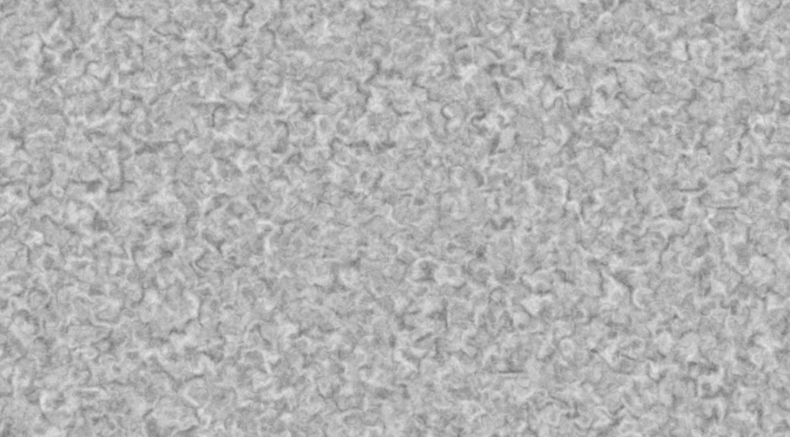
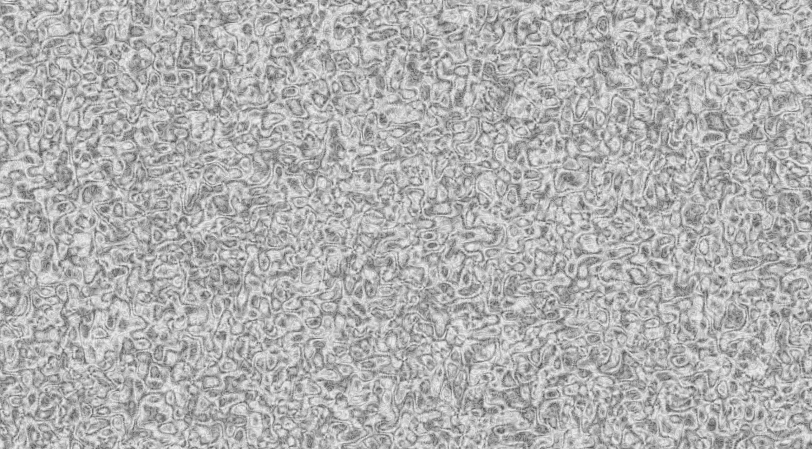
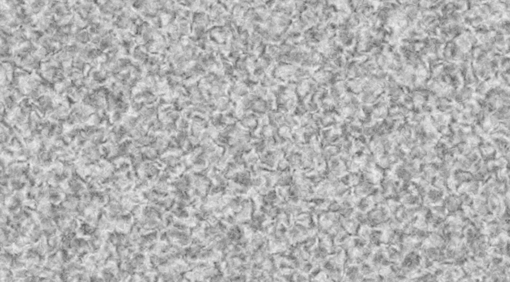
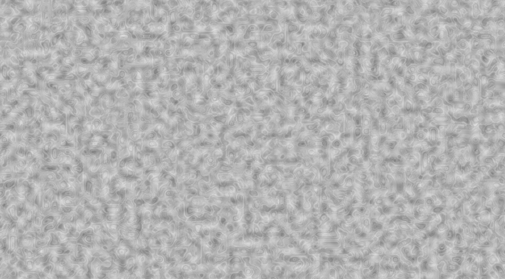
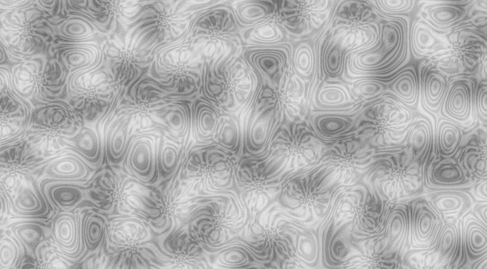
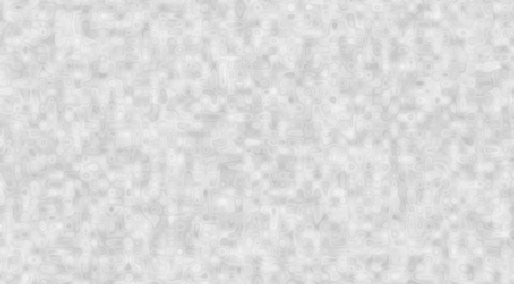

# Warping

One of the common ways to make noise look more interesting is to use one noise function to effect the input of another.
This is called domain warping.

## Translation-Based Warping

The simplest way to warp noise is to run some noise function to get a vector, and add that vector to the input before passing it to another noise function.
There are two core types for this `Offset`, which does the adding, and `RandomElements`, which makes the vectors to add.
Here's how to warp perlin noise within fbm:

```rust
use noiz::prelude::*;
use bevy_math::prelude::*;
let noise = Noise::<LayeredNoise<
    Normed<f32>,
    Persistence,
    FractalLayers<Octave<(
        Offset<RandomElements<MixCellGradients<
            OrthoGrid,
            Smoothstep,
            QuickGradients,
        >>>,
        MixCellGradients<OrthoGrid, Smoothstep, QuickGradients>,
    )>>,
>>::default();
let value: f32 = noise.sample(Vec2::new(1.5, 2.0));
```

As you can see, `Offset` samples `RandomElements` to produce a vector.
That vector then offsets the input location.
The now offset input is then passed to `MixCellGradients`.
This produces:



Notice that the noise type for `RandomElements` does not need to match the one being warped, though in these examples it does.
Swapping in simplex noise in both places gives:



Notice, that the inner noise function of `RandomElements` can be anything that produces a scalar value.
This results in one sample per dimension, which is expensive.
Noiz provides an alternative, `MixCellValuesForDomain`, which is a faster version of `RandomElements` paired with `MixCellValues`.
Here's an example of that with value noise:

```rust
use noiz::prelude::*;
use bevy_math::prelude::*;
let noise = Noise::<LayeredNoise<
    Normed<f32>,
    Persistence,
    FractalLayers<Octave<(
        Offset<MixCellValuesForDomain<OrthoGrid, Smoothstep, SNorm>>,
        MixCellGradients<OrthoGrid, Smoothstep, QuickGradients>,
    )>>,
>>::default();
let value: f32 = noise.sample(Vec2::new(1.5, 2.0));
```

This produces:



## Modifying-Based Warping

What if each offset applied not only to the current layer, but also to all subsequent layers?
That's what `DomainWarp` does.
Here's an example:

```rust
use noiz::prelude::*;
use bevy_math::prelude::*;
let noise = Noise::<LayeredNoise<
    Normed<f32>,
    Persistence,
    FractalLayers<(
        DomainWarp<RandomElements<MixCellGradients<
            OrthoGrid,
            Smoothstep,
            QuickGradients,
        >>>,
        Octave<MixCellGradients<
            OrthoGrid,
            Smoothstep,
            QuickGradients
        >>,
    )>,
>>::default();
let value: f32 = noise.sample(Vec2::new(1.5, 2.0));
```

Notice how `DomainWarp` is a layer; it is not inside the `Octave` like `Offset` was.
Here's what the above produces:



Here it is with simplex:



And with value noise:



## Derivatives

When using derivatives, know that warping like this can have surprising affects.
The derivatives that noiz calculates are meant to be useful and fast, not mathematically rigorous.
Before assuming they are perfectly correct, test it out in the "show_gradients" example.
If you see gradients that are clearly wrong, and you think they should be right or could be corrected, please open an issue in github.
But in general, you should expect warped noise to have strange derivatives.
